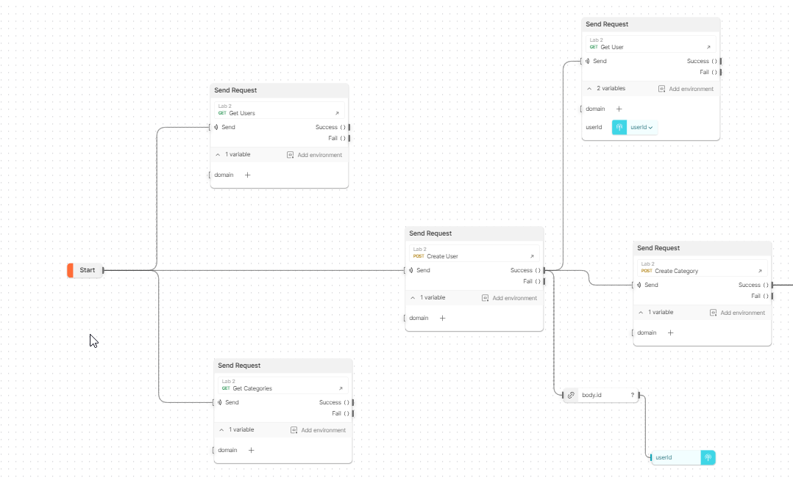
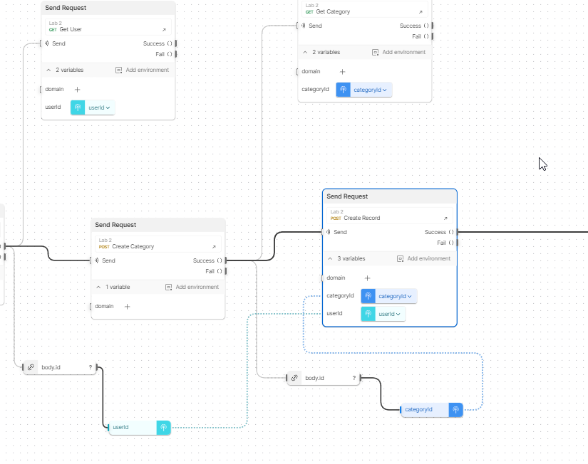
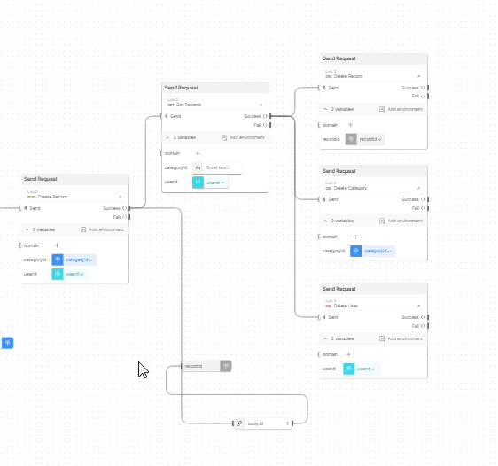

# back-lab2

## Installation and starting of the service

    docker compose up

The web service will be available under http://localhost:8080

## Deployed instance 

A deployed instance of this web service is available under https://back-lab2.onrender.com

## Postman collection
The Postman collection of all API requests is under `postman/Lab 2.postman_collection.json`

## Postman flow
link: https://api.postman.com/collections/31560878-f3715aa9-5534-4f52-802c-f50e384ae78b?access_key=PMAT-01HH0NQ0PDHF28QJTT2YXN0Z0D
A postman flow was created to test the API

